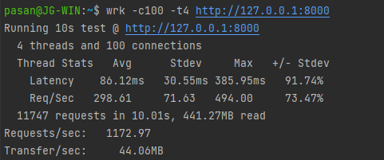
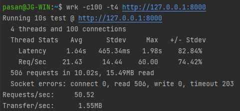
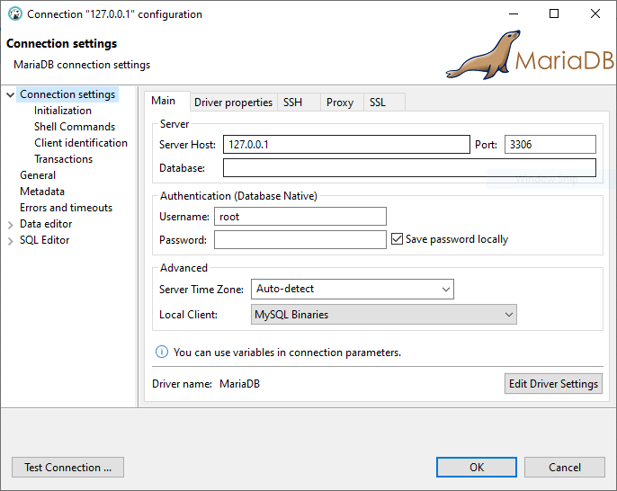

<p align="center"><a href="https://laravel.com" target="_blank"></a></p>

## Introduction

Follow these steps to set up your development environment before doing any active development for the project.

## About App

Laravel is a web application framework with expressive, elegant syntax. We believe development must be an enjoyable and
creative experience to be truly fulfilling. Laravel takes the pain out of development by easing common tasks used in
many web projects.

## Laravel Octane

Laravel App uses [Octane](https://laravel.com/docs/8.x/octane) to serve the application with RoadRunner enhancing performance and speed.

### Benchmark Test

| Octane Serve (RoadRunner)                             | PHP Serve                               |
|-------------------------------------------------------|-----------------------------------------|
|  |  |

## WSL

Currently, [Octane doesn't support development on Windows OS.](https://github.com/laravel/octane/issues/282#issuecomment-842954893)
The only option for Windows developers is to set up the development server through [WSL](https://docs.microsoft.com/en-us/windows/wsl/about).

Check all prerequisites before installing.
  - [Install WSL](https://docs.microsoft.com/en-us/windows/wsl/install) - Ubuntu 20.04 LTS (Default)
  - [Install PHP 8 on WSL](https://linuxh2o.com/how-to-install-php-8-on-ubuntu-20-04-debian-10/)
  - [Install composer on WSL](https://www.digitalocean.com/community/tutorials/how-to-install-composer-on-ubuntu-20-04-quickstart)
  - [Install MariaDB Server on WSL](https://r00t4bl3.com/post/how-to-install-mariadb-server-on-windows-10-using-windows-subsystem-for-linux-wsl2)
  - [Install NodeJS and NPM on WSL](https://simplernerd.com/install-node-npm-wsl2/)

> Note: This is a Laravel 8 project and requires PHP 8.0.
> If you encounter any issues with missing php extensions, please install them using `sudo apt install php8.0-<extension>`.

Example:
- `sudo apt-get install php8.0-zip`
- `sudo apt install php8.0-xml`
- `sudo apt install php8.0-myqsl`

## IDE

[VS Code](https://code.visualstudio.com/download) is the recommended IDE for development. [Set up WSL in VS Code.](https://code.visualstudio.com/docs/remote/wsl)

For performance reasons, make sure to open your project in the **Linux file system**. [See docs.](https://docs.microsoft.com/en-us/windows/wsl/filesystems#file-storage-and-performance-across-file-systems)

> - Use the Linux file system root directory: `\\wsl$\Ubuntu\home\<user name>\Project`
> - Not the Windows file system root directory: `/mnt/c/Users/<user name>/Project$ or C:\Users\<user name>\Project`

In your WSL terminal,

- `cd` to `~/` (`/home/<user>/`)
  ```bash
  cd ~
  ```
- Clone the repo to a location inside `/home/<user>/`
- `cd` to `<project>`
  ```bash
  cd <project>
  ```
- Open project in VS Code
  ```bash
  code .
  ```

- ### MariaDB

To connect to your application's MySQL database from your local machine, you may use a graphical database management application such as [DBeaver](https://dbeaver.io/download/).
By default, the MySQL database is accessible at `127.0.0.1` port `3306`.



## Vue 3

[Vue 3](https://v3.vuejs.org/) is used to develop the frontend of the application.

- All Vue related files are located in `./resources/js`.
  - It contains a standard Vue application with the `package.json` at the project root.
  - Future `npm packages` must be installed as `devDependencies`. [See more](https://laracasts.com/discuss/channels/laravel/what-do-i-put-in-devdependencies-in-packagejson)
  ```bash
  npm install -D <package-name>
  ```
- Vue related styles are located in `./resources/js/styles`.
- Global Styles are located in `./resources/scss`.
  - Import all global styles to `./resource/sass/app.scss`.
  - All styles in `app.scss` will be compiled to `CSS` during watch.

## Run Development Server

- ### Install Dependencies
  ```bash
  composer update
  ```
  ```bash
  npm install
  ```

- ### Laravel
  - Copy `.env.example` to `.env` and update the environment variables.
  ```bash
  cp .env.example .env
  ```
  - Copy `module_statuses.json.example` to `module_statuses.json`
  ```bash
  cp module_statuses.json.example module_statuses.json
  ```
  - Copy `module_statuses_tenant.json.example` to `module_statuses_tenant.json`
  ```bash
  cp module_statuses_tenant.json.example module_statuses_tenant.json
  ```
  - Generate `APP_KEY`
  ```bash
  php artisan key:generate
  ```
  - Generate `JWT_SECRET`
  ```bash
  php artisan jwt:secret
  ```
  - Start MariaDB Service
  ```bash
  sudo service mariadb start
  ```
  - Create a new database with the name given in `DB_DATABASE` variable in `.env` file in MariaDB

  - Run initial migrations
  ```bash
  php artisan migrate
  ```
  - Run initial seeders
  ```bash
  php artisan db:seed
  ```
  - Run initial tenant migrations
  ```bash
  php artisan tenants:migrate
  ```
  - Run initial tenant seeders
  ```bash
  php artisan tenants:seed
  ```
  - Serve backend (Watch)
  ```bash
  php artisan octane:start --watch
  ```
  Running Octane for the first time will ask you to download the RoadRunner binary. Type `yes` and hit `Enter` to continue.
  ```bash
  Unable to locate RoadRunner binary. Should Octane download the binary for your operating system? (yes/no) [yes]:
  > yes
  ```

- ### Vue
  - Serve Vue application (Watch). See other scripts in `package.json`
  ```bash
  npm run watch
  ```
  - Build Vue application for Production
  ```bash
  npm run prod
  ```

  - Open central application [`http://localhost:8000/`](http://localhost:8000/)
  - Open tenant application [`http://<tenant_id>.localhost:8000/`](http://<tenant_id>.localhost:8000/)

## Tenants

This project uses [stancl/tenancy](https://tenancyforlaravel.com/docs/v3/introduction/) V3 package to manage multi-tenant operations.

- ### Migrations and Seeders
  Tenant specific migrations and seeders are located in `database/migrations/tenant` and `database/seeders/tenant` directories respectively.

  - #### Migrations
    - Tenant migrations use migration files in `database/migrations/tenant/`
    - Create a new tenant migration
    ```php
    php artisan make:migration create_tenant_demos_table --path=/database/migrations/tenant
    ```
    - Run tenant migrations
    ```php
    php artisan tenants:migrate
    ```
    - See [migration docs](https://tenancyforlaravel.com/docs/v3/migrations)

  - #### Seeders
    - Tenant seeders use seeder files in `database/seeders/tenant/TenantDatabaseSeeder.php`
    - Create a new seeder
    ```php
    php artisan make:seeder TenantDemoTableSeeder
    ```
    - Move the newly created seeder to `database/seeders/tenant`
    - Call `TenantDemoTableSeeder` in `run` method:
    ```php
    $this->call(TenantDemoTableSeeder::class);
    ```
      - Run all tenant seeders
      ```php
      php artisan tenants:seed
      ```
      - Run tenant specific seeders
      ```php
      php artisan tenants:seed --class=Database\Seeders\tenant\TenantDemoTableSeeder
      ```
    - See [seeder docs](https://tenancyforlaravel.com/docs/v3/console-commands/#rollback-and-seed)

## Modules
Laravel App uses [laravel-modules](https://nwidart.com/laravel-modules/v6/introduction) V6 package to manage the modular structure of the app.

# Streamers
